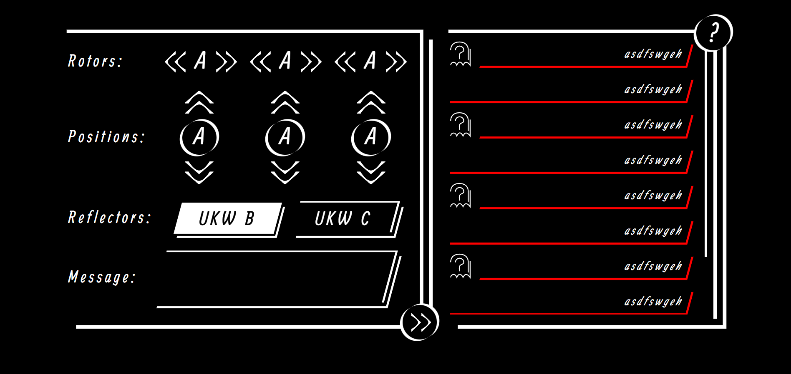

# 🎯 Enigmus Chat

<div align="center">
  
  
  
  
  
  
</div>

## 📖 Описание

Enigmus Chat - это анонимный чат, основанный на шифровании, вдохновленном машиной Enigma. Пользователи могут отправлять и получать сообщения, которые видны только в том случае, если настройки шифрования получателя совпадают с настройками отправителя. Это создает уникальный уровень приватности, подобный настройке на определенную радиоволну – только те, у кого есть точная конфигурация, могут расшифровать и прочитать сообщения. С огромным количеством возможных комбинаций (роторы, позиции, рефлекторы), взлом настроек очень сложен.

## 🎨 Дизайн

Дизайн UI был создан разработчиком. Посмотрите дизайн в Figma здесь: [Дизайн Figma](https://www.figma.com/design/tavRbJORvSV64aM2v80zWp/Enigmus?node-id=0-1&t=LiIBYa4uM28akqPY-1)

<div align="center">
  
</div>

## ✨ Функции

- **Анонимное Общение**: Сообщения шифруются и расшифровываются только при совпадении настроек Enigma.
- **Шифрование на Основе Enigma**: Реализует роторы, позиции и рефлекторы для безопасного шифрования.
- **Чат в Реальном Времени**: Отправка и получение сообщений в реальном времени.
- **Веб-Интерфейс**: Адаптивный веб-интерфейс для легкого доступа.
- **Встроенный Туториал**: Руководство по пониманию механики шифрования.
- **История Сообщений**: Просмотр сообщений до 12 часов.

## 🔧 Как это работает

1. **Конфигурация Настроек**: Настройте роторы (I-V), позиции (A-Z) и рефлектор (UKW B или C).
2. **Шифрование**: Сообщения шифруются с использованием текущих настроек Enigma перед отправкой.
3. **Расшифровка**: Сообщения появляются расшифрованными только если ваши настройки совпадают с настройками отправителя.
4. **Анонимность**: Без точных настроек сообщения остаются зашифрованными и нечитаемыми.

## 🚀 Установка и запуск

### Предварительные требования

- Python 3.7+
- FastAPI
- Uvicorn

### Установка

1. Клонируйте репозиторий:
```bash
git clone https://github.com/yourusername/enigmus-chat.git
cd enigmus-chat
```

2. Установите зависимости:
```bash
pip install fastapi uvicorn
```

### Запуск

```bash
python main.py
```

Откройте [http://127.127.127.127:8000](http://127.127.127.127:8000) в браузере.

## 📋 Использование

- **Присоединиться**: Нажмите "Join", чтобы войти в чат.
- **Настроить Параметры**: Используйте левую панель для выбора роторов, установки позиций и выбора рефлектора.
- **Отправить Сообщение**: Введите сообщение и нажмите кнопку отправки.
- **Просмотр Сообщений**: Сообщения появятся в правой панели, если ваши настройки совпадают.
- **Туториал**: Нажмите кнопку "?" для руководства.

### Примечания
- Сообщения только на английском (A-Z).
- Цифры и знаки препинания не шифруются.
- Максимальная длина сообщения: 350 символов.
- Сообщения хранятся временно (12 часов).

## 🛠 Технологии

- **Бэкенд**: Python, FastAPI, Uvicorn
- **Фронтенд**: HTML, CSS, JavaScript (jQuery)
- **Шифрование**: Собственная реализация Enigma на Python

## 📁 Структура проекта

```
enigmus-chat/
├── main.py              # Сервер FastAPI
├── GradeScript.py       # Логика шифрования Enigma
├── public/
│   ├── index.html       # Основной веб-интерфейс
│   └── static/          # Статические ресурсы (CSS, изображения)
├── screenshots/         # Скриншоты интерфейса
├── Trash/               # Старые/неиспользуемые файлы
├── .gitignore           # Правила игнорирования Git
└── README.md            # Этот файл
```

## 🎨 Кастомизация

### Добавление новых настроек Enigma

Отредактируйте файл `GradeScript.py`, добавив новые роторы или рефлекторы:

```python
# Пример добавления нового ротора
Rotor_VI = ["ABCDEFGHIJKLMNOPQRSTUVWXYZ", "A"]  # Пример
Rotors = {"I": Rotor_I, "II": Rotor_II, ..., "VI": Rotor_VI}
```
